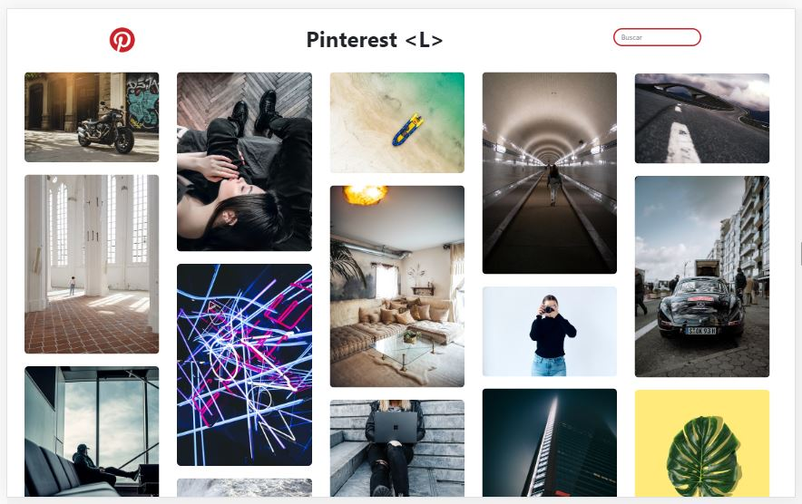
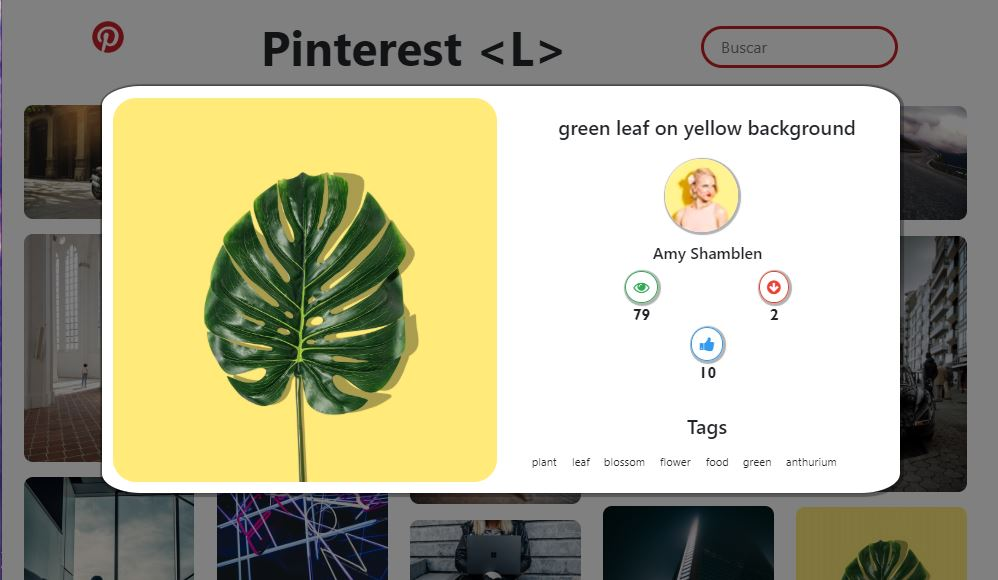
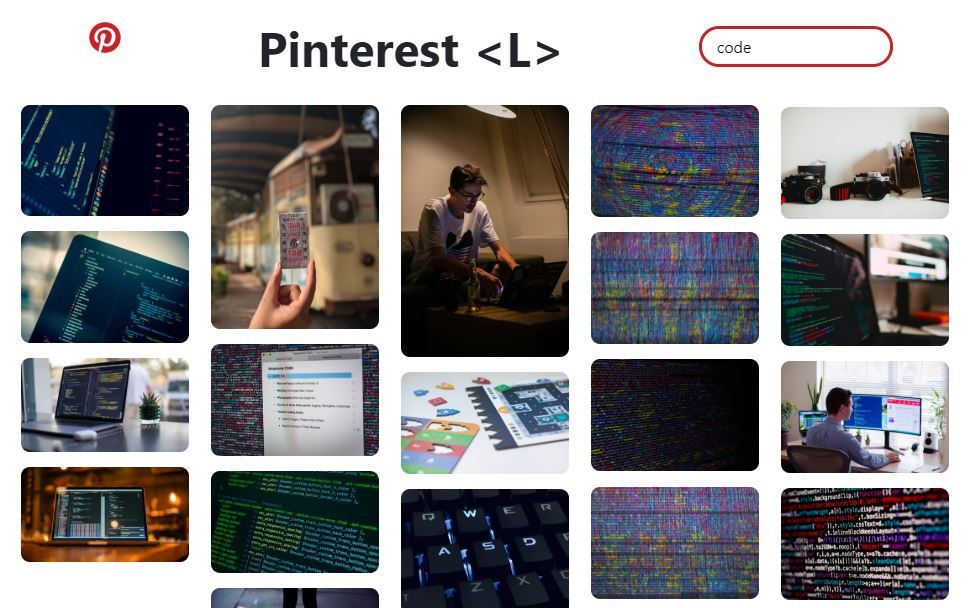

# REPLICA DE PINTEREST <L>

## Índice

* [1. Resumen del proyecto](#1-resumen-del-proyecto)
* [2. Definición del producto](#2-definición-del-producto)
* [3. Investigación UX](#3-investigación-UX)
* [4. Historias de usuario](#4-historias-de-usuario)
* [5. Diseño de la Interfaz de Usuario](#5-Diseño-de-la-Interfaz-de-Usuario)
* [6. Imagen del proyecto final](#6-imagen-del-proyecto-final)

***

## 1. Resumen del proyecto

En este proyecto se construyo una interfaz webque es una replica de pinterest, donde el usuario puede ver imágenes aleatorias de buena calidad y puede buscar fotos especificas según su agrado. Para desarrollar el proyecto se uso el framework Angular de Javascript.

## 2. Definición del producto

Pinterest es una plataforma que permite a los usuarios crear y administrar, en tableros personales temáticos, colecciones de imágenes como eventos, intereses, aficiones y mucho más.

En este proyecto se creo la funcionalidad básica de Pinterest de poder ver las imágenes y buscar las de tu preferencia.

## 3. Historias de usuario

Durante el desarrollo del proyecto se realizo las siguientes historias de usuario: 

3.1. Yo como usuario puedo ver 20 imágenes aleatorias y al hacer scrollDown cargar 20 imágenes más.

  * DEFINICIÓN DE TERMINADO
      - El código cumple con la guía de estilos guardada (Tslint).
      - El código esta en el repositorio.
      - La publicación en el GitHub-pages.

  * CRITERIOS DE ACEPTACIÓN
      - El usuario puede ver las 20 imágenes iniciales y aleatorias.
      - El usuario realiza un scroll para abajo y se cargan 20 imágenes más.
      - El usuario realiza un scroll para arriba y se van eliminando 20 imágenes.

3.2. Yo como usuario quiero ver información sobre la imagen en un modal al hacer click a la imagen.

   * DEFINICIÓN DE TERMINADO
      - El código cumple con la guía de estilos guardada (Eslint).
      - El código esta en el repositorio.
      - La publicación en el GitHub-pages. 

   * CRITERIOS DE ACEPTACIÓN
      - El usuario puede ver las imágenes aleatorias.
      - El usuario da click a la imagen y se puede ver el título, el fotógrafo, la cantidad de likes, descargas, vistas y tags relacionados a la imagen.

3.3. Yo como usuario quiero buscar imágenes de acuerdo a una categoria. 

  * DEFINICIÓN DE TERMINADO
      - El código cumple con la guía de estilos guardada (Eslint).
      - El código esta en el repositorio.
      - La publicación en el GitHub-pages. 

   * CRITERIOS DE ACEPTACIÓN
      - El usuario puede digitar la categoria que quiera en la sección de búsqueda.
      - El usuario podrá ver las imágenes relacionadas solo a la categoria que puso en el input.
      - El usuario puede volver a ver las imágenes iniciales borrando la categoria en el input.

## 5. Imagen del Proyecto Final.

* Página de Inicio

  

* Modal

  

* Búsqueda

  

  